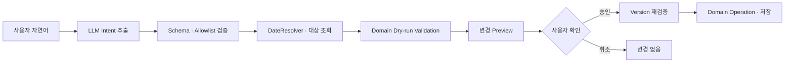

# My Planner 제약사항

이 폴더는 My Planner를 설계하고 구현할 때 반드시 지켜야 하는 제품·실행 환경·Local LLM·안전성 제약을 관리한다.

`work_concept/`가 시스템을 무엇으로 구성하고 왜 그렇게 설계하는지를 설명하고, `workflow/`가 사용자 행동과 내부 처리 순서를 설명한다면, `Constraint/`는 설계와 구현이 넘지 않아야 할 경계를 정의한다.

제약이 변경되면 관련 설계와 구현에 미치는 영향을 먼저 검토하고 이 문서를 갱신한다.

## 1. 제품 목표

My Planner는 사용자가 배포된 데스크톱 프로그램에서 직접 일정과 업무를 관리하면서, 필요할 때 자연어 명령으로 Local LLM의 도움을 받을 수 있는 시스템을 목표로 한다.

사용자는 다음 두 입력 방식을 함께 사용할 수 있어야 한다.

- 기존 UI에서 Task, Event, Project를 직접 생성·조회·수정·삭제한다.
- 자연어로 요청하면 Local LLM이 요청을 구조화된 일정관리 명령으로 해석한다.

두 입력 방식은 서로 다른 데이터 저장소를 만들지 않으며 동일한 Domain과 저장 절차를 사용한다.

## 2. 최소 실행 환경

우선 지원할 최소 환경은 다음과 같다.

- CPU 기반 추론
- 사용 가능한 GPU가 없어도 실행 가능
- 약 4GB RAM 환경에서 앱과 Local LLM을 함께 실행 가능
- 인터넷 연결과 사용자 계정 없이 핵심 기능 사용 가능
- 한 번에 하나의 Workspace를 사용하는 단일 사용자 데스크톱 앱

기능이나 모델을 선택할 때 고성능 개발 환경보다 이 최소 환경에서의 실행 가능성을 우선한다.

메모리 목표는 앱 전체를 포함한다. 모델 파일 크기만 4GB 이내인 것으로는 조건을 충족한 것으로 판단하지 않으며, 모델 로딩·추론 캐시·UI·Core·SQLite의 실제 메모리를 함께 측정한다.

## 3. Local LLM의 역할

Local LLM은 범용 대화나 데이터 저장소 역할을 맡지 않는다. 주 역할은 사용자의 자연어를 제한된 일정관리 Intent와 arguments로 변환하는 것이다.

초기 지원 범위는 다음과 같다.

```text
CREATE_TASK · UPDATE_TASK · DELETE_TASK · COMPLETE_TASK
CREATE_EVENT · UPDATE_EVENT · DELETE_EVENT
CREATE_PROJECT · UPDATE_PROJECT
QUERY_TASK · QUERY_SCHEDULE · QUERY_PROJECT · UNKNOWN
```

LLM 출력은 자유 문장보다 JSON Schema 또는 grammar로 제한된 구조를 우선한다.

```json
{
  "schema_version": 1,
  "intent": "CREATE_EVENT",
  "confidence": 0.9,
  "arguments": {
    "title": "병원 예약",
    "date_expression": "내일",
    "start_time": "15:00"
  },
  "missing_fields": [],
  "requires_confirmation": true
}
```

LLM은 다음 작업을 직접 수행하지 않는다.

- 파일 또는 SQLite 읽기·쓰기
- OS 명령 실행
- Workspace 밖의 경로 접근
- 상대 날짜의 최종 확정
- Domain validation 생략
- 사용자 확인 없는 일정 변경 적용

상대 날짜 계산, 대상 검색, 중복 검사, 권한 확인, 버전 검사와 실제 저장은 일반 프로그램 로직이 담당한다.

## 4. 모델 및 추론 제약

- 매우 작은 양자화 모델부터 검증한다.
- 모델 선택은 정확도뿐 아니라 실제 RAM 사용량과 CPU 응답 시간을 함께 평가한다.
- 전체 Workspace나 Markdown 원문을 매 요청마다 모델에 전달하지 않는다.
- 현재 명령과 해석에 필요한 최소 후보 정보만 context로 전달한다.
- 추론 요청은 우선 단일 queue에서 순차 처리한다.
- AI 기능을 처음 사용할 때 모델을 로드하고, 일정 시간 사용하지 않으면 종료하는 on-demand 전략을 우선한다.
- timeout, 취소, 비정상 JSON, process crash를 처리할 수 있어야 한다.
- LLM을 사용할 수 없어도 수동 일정관리 기능은 정상적으로 동작해야 한다.

모델이나 runtime을 확정하기 전에 최소 환경에서 반복 측정한다. 개발 컴퓨터에서 한 번 동작한 결과만으로 채택하지 않는다.

## 5. 자연어 명령의 안전성

기본 처리 경계는 다음과 같다.



- LLM 응답 자체에는 실행 권한이 없다.
- 생성·수정·삭제 결과는 적용 전에 사용자에게 보여준다.
- 날짜, 시간 또는 대상이 모호하면 임의로 확정하지 않고 사용자 선택을 요청한다.
- 수정·삭제 대상이 여러 개이면 후보를 제시한다.
- 낮은 confidence, 잘못된 schema 또는 허용하지 않은 Intent는 `UNKNOWN`으로 처리한다.
- 여러 Entity를 변경하는 요청은 전체가 유효할 때만 적용한다.
- Preview 이후 데이터가 변경되었으면 최신 상태를 기준으로 다시 검증한다.

## 6. 데이터와 개인정보 제약

- 일정 데이터는 사용자가 선택한 로컬 Workspace에 저장한다.
- Markdown을 원본으로 사용하고 SQLite는 재생성 가능한 index/cache로 사용한다.
- 일정 본문, 자연어 명령과 파일 절대 경로를 기본 로그에 기록하지 않는다.
- Frontend와 LLM에 Workspace 절대 경로를 노출하지 않는다.
- 인터넷이나 외부 서버 전송을 핵심 기능의 전제로 두지 않는다.
- 외부에서 수정된 Markdown과 LLM 출력은 모두 신뢰하지 않는 입력으로 처리한다.

## 7. UI 제약

UI는 AI가 없어도 완전한 수동 일정관리 기능을 제공해야 한다.

AI 명령 UI는 최소한 다음 상태를 표현해야 한다.

- 모델이 설치되지 않았거나 준비되지 않은 상태
- 모델 로딩 및 명령 분석 중
- 정상적인 변경 Preview
- 날짜·시간·대상이 모호하여 추가 입력이 필요한 상태
- 여러 대상 후보 중 하나를 선택하는 상태
- timeout, 메모리 부족 또는 모델 process 실패
- 수동 입력 화면으로 전환할 수 있는 상태

AI가 생성한 데이터와 UI에서 직접 생성한 데이터는 같은 상세 화면과 편집 흐름을 사용한다.

## 8. 선행 검증 순서

현재 목업 이후에는 다음 순서로 가능성을 검증한다.

1. 일정관리 Intent와 평가 문장 집합을 정의한다.
2. Local LLM을 독립적인 실험 환경에서 실행한다.
3. JSON 형식 준수율, Intent 정확도, 필드 추출, 모호성 처리 결과를 측정한다.
4. 최소 환경에서 응답 시간과 실제 최대 RAM 사용량을 측정한다.
5. 기준을 만족한 경우 현재 목업의 AI Preview 인터페이스에 연결한다.
6. 모델의 실제 실패 유형을 바탕으로 UI 상태와 추가 질문 흐름을 보완한다.

초기 실험은 UI, Tauri, 저장소 전체와 동시에 구현하지 않는다. 모델 가능성을 작은 CLI 또는 테스트 harness로 먼저 검증하고, 검증된 구조만 앱에 연결한다.

## 9. 초기 평가 기준

모델 후보는 최소한 다음 항목으로 비교한다.

- Intent 분류 정확도
- 제목·날짜·시간·중요도 등 필드 추출 정확도
- JSON Schema 준수율
- 모호한 요청을 임의로 실행하지 않는 비율
- 반복 요청 시 결과 일관성
- cold load 시간과 warm 응답 시간
- 최대 메모리 사용량
- timeout 및 process 재시작 후 복구 가능 여부

정확한 합격 수치는 평가 문장 집합과 첫 벤치마크 결과를 확인한 뒤 별도 문서로 확정한다.

## 10. 범위 밖 항목

초기 검증과 MVP에서는 다음 항목을 필수 범위로 두지 않는다.

- Cloud Sync
- 계정과 인증 서버
- 원격 LLM API
- 범용 챗봇
- RAG
- 외부 Calendar 연동
- 여러 Workspace 동시 실행
- GPU 전용 기능

이 항목을 추가하려면 4GB RAM, offline-first, 사용자 소유 데이터와 수동 기능 독립성이라는 상위 제약을 훼손하지 않는지 먼저 검토한다.
