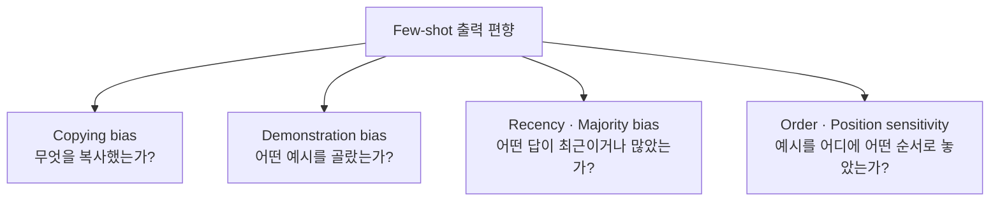
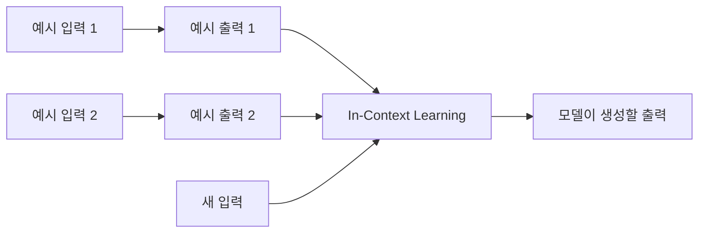
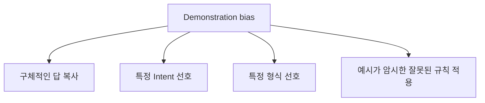

# Few-shot Bias 개념 가이드

이 문서는 Local LLM의 few-shot prompt에서 자주 관찰되는 네 가지 현상을 쉽게 구분하기 위한 입문 자료다.

다루는 개념:

1. Copying bias
2. Demonstration bias
3. Recency/majority bias
4. Order/position sensitivity

네 개념은 서로 완전히 독립적이지 않다. 하나의 잘못된 출력에 여러 bias가 동시에 영향을 줄 수 있다.

## 1. 한눈에 비교하기

| 개념 | 핵심 질문 | 대표 증상 | 바꾸어 볼 조건 |
|---|---|---|---|
| Copying bias | 예시의 구체적인 답을 복사했는가? | 입력에 없는 예시 값이 출력됨 | 예시의 값만 교체 |
| Demonstration bias | 어떤 예시를 골랐는지가 해석을 바꿨는가? | 예시 A와 B에서 Intent나 의미가 달라짐 | 예시 집합 교체 |
| Recency/majority bias | 최근 또는 많이 나온 답을 선호했는가? | 마지막·다수 label로 출력이 쏠림 | 빈도와 마지막 예시 변경 |
| Order/position sensitivity | 같은 예시도 순서·위치에 따라 결과가 달라지는가? | 내용은 같지만 배열만 바꿔도 출력 변화 | 순서와 prompt 위치 변경 |

간단히 표현하면 다음과 같다.

```text
Copying bias
→ 무엇을 복사했는가?

Demonstration bias
→ 어떤 예시를 골랐는가?

Recency/majority bias
→ 어떤 답이 최근이거나 많았는가?

Order/position sensitivity
→ 같은 예시를 어디에 어떤 순서로 놓았는가?
```



## 2. 공통 배경: Few-shot과 In-Context Learning

Few-shot prompting은 prompt 안에 몇 개의 입력·출력 예시를 제공하는 방식이다.

```text
예시 입력 1 → 예시 출력 1
예시 입력 2 → 예시 출력 2
새 입력 → 모델이 생성할 출력
```



모델 가중치를 다시 학습하지 않아도 예시를 보고 task의 형식과 규칙을 추정할 수 있다. 이를 In-Context Learning, ICL이라고 한다.

예시는 모델에 여러 신호를 동시에 준다.

- 어떤 task인지
- 사용할 label과 Intent가 무엇인지
- 입력과 출력 형식이 무엇인지
- 어떤 필드를 포함하는지
- 구체적으로 어떤 단어와 값이 등장하는지
- 어떤 답이 자주 또는 최근에 나왔는지

문제는 모델이 우리가 의도한 추상 규칙과 예시의 우연한 구체 값을 항상 정확하게 구분하지는 못한다는 것이다.

---

## 3. Copying Bias

### 3.1 정의

Copying bias는 모델이 demonstration에서 배워야 할 규칙을 새 입력에 일반화하지 않고, demonstration answer의 일부 또는 전체를 그대로 복사하는 경향이다.

### 3.2 쉬운 예시

Prompt의 예시:

```text
입력: 다음주 화요일 오후 2시에 팀 회의 잡아줘
출력:
  title = 팀 회의
  date_expression = 다음주 화요일
  start_time = 14:00
```

새 입력:

```text
다음주에 회의 하나 잡아줘
```

잘못된 출력:

```text
title = 팀 회의
date_expression = 다음주 화요일
start_time = 14:00
```

새 입력에는 `팀`, `화요일`, `오후 2시`가 없다. 그런데 예시 answer의 값이 그대로 나타났다. 이것이 copy-like error의 전형적인 모습이다.

### 3.3 단순한 형식 모방과의 차이

모델이 다음 JSON 구조를 따라 하는 것은 의도한 행동이다.

```json
{
  "title": "...",
  "date_expression": "...",
  "start_time": "..."
}
```

하지만 예시의 `팀 회의`, `화요일`, `14:00`까지 따라 하는 것은 잘못된 값 복사다.

```text
형식 복사: 성공으로 볼 수 있음
구체 값 복사: 입력 근거가 없으면 실패
```

### 3.4 왜 위험한가?

일정관리에서는 복사된 값이 실제 데이터 변경으로 이어질 수 있다.

- 사용자가 말하지 않은 날짜에 일정 등록
- 입력에 없는 시간으로 예약 생성
- 다른 사람이나 프로젝트 이름을 잘못 사용
- 삭제·수정 대상 오선택

JSON 문법이 완벽해도 값이 잘못되면 안전하지 않다.

### 3.5 확인하는 테스트

예시의 구체 값만 바꾸고 같은 새 입력을 다시 실행한다.

```text
조건 A 예시: 팀 회의 / 화요일 / 14:00
조건 B 예시: 치과 검진 / 목요일 / 09:30

공통 새 입력: 다음주에 회의 하나 잡아줘
```

새 출력이 A에서는 `화요일 14:00`, B에서는 `목요일 09:30` 쪽으로 이동하면 copying bias 가설이 강해진다.

### 3.6 완화 방법

- 단일 concrete example에 의존하지 않는다.
- 서로 다른 값의 예시를 사용한다.
- 입력에 없는 값은 생성하지 않는 negative example을 제공한다.
- 각 field의 `source_span` 또는 `evidence`를 함께 출력하게 한다.
- Core가 출력 값이 사용자 입력에 근거하는지 검사한다.
- 근거 없는 값은 저장하지 않고 사용자에게 질문한다.

### 3.7 관련 논문

Ali, Wolf, Titov의 *Mitigating Copy Bias in In-Context Learning through Neuron Pruning*은 demonstration answer를 복사하고 underlying pattern을 일반화하지 못하는 현상을 직접 `copying bias`로 다룬다.

- <https://arxiv.org/abs/2410.01288>
- 연구 상태: arXiv preprint / OpenReview 공개

---

## 4. Demonstration Bias

### 4.1 정의

Demonstration bias는 어떤 예시를 선택했는지, 그 예시가 어떤 의미를 암시하는지에 따라 모델의 task 해석과 출력이 편향되는 넓은 현상이다.

Copying bias보다 상위에 있는 개념으로 이해할 수 있다.

```text
Demonstration bias
├ 구체적인 답 복사
├ 특정 Intent 선호
├ 특정 형식 선호
└ 예시가 암시한 잘못된 규칙 적용
```



### 4.2 쉬운 예시

예시 집합 A가 모두 Event인 경우:

```text
병원 예약 → CREATE_EVENT
팀 회의 → CREATE_EVENT
식사 약속 → CREATE_EVENT
```

새 입력:

```text
금요일까지 보고서 작성해줘
```

모델이 이를 `CREATE_TASK`가 아닌 `CREATE_EVENT`로 분류할 수 있다. 새 입력의 의미보다 예시 집합이 보여준 task 분포에 끌린 것이다.

예시 집합 B에 Task 사례를 균형 있게 추가했을 때 올바르게 분류된다면 demonstration selection의 영향을 의심할 수 있다.

### 4.3 Semantic Ambiguity

하나의 demonstration은 여러 규칙을 동시에 암시할 수 있다.

```text
예시:
다음주 화요일 오후 2시에 팀 회의 잡아줘
→ CREATE_EVENT
```

사람이 의도한 규칙:

```text
특정 날짜와 시각의 약속·회의는 Event다.
```

모델이 잘못 이해할 수 있는 규칙:

```text
회의라는 단어가 있으면 화요일 14:00 Event를 만든다.
```

예시가 적을수록 어떤 부분이 variable이고 어떤 부분이 task rule인지 분리하기 어렵다.

### 4.4 확인하는 테스트

새 입력과 모든 실행 옵션은 그대로 두고 demonstration 집합만 바꾼다.

```text
Run A: Event 예시 위주
Run B: Task 예시 위주
Run C: Task와 Event 균형
Run D: 누락·모호성 예시 포함
```

Intent 정확도와 hallucinated field rate가 어떻게 변하는지 비교한다.

### 4.5 완화 방법

- 실제 입력 분포를 대표하는 예시를 선택한다.
- Intent별 예시 수를 균형 있게 구성한다.
- 정상 사례뿐 아니라 누락·모호·거부 사례도 포함한다.
- 예시가 의미하는 규칙을 자연어로 명시한다.
- 평가 문장과 지나치게 유사한 예시를 넣지 않는다.
- 예시 집합을 바꾸면 새로운 Test Run으로 기록한다.

### 4.6 관련 논문

Li et al.은 demonstration selection과 ordering에 따른 성능 변화를 demonstration bias로 설명하고, demonstration이 여러 mapping을 암시하는 semantic ambiguity를 주요 원인으로 분석했다.

- *Debiasing In-Context Learning by Instructing LLMs How to Follow Demonstrations*
- Findings of ACL 2024
- <https://aclanthology.org/2024.findings-acl.430/>

Min et al.은 demonstration이 정답 mapping뿐 아니라 label space, 입력 분포와 전체 format을 강하게 제공할 수 있음을 보였다.

- *Rethinking the Role of Demonstrations: What Makes In-Context Learning Work?*
- EMNLP 2022
- <https://aclanthology.org/2022.emnlp-main.759/>

---

## 5. Recency Bias와 Majority Bias

두 현상은 함께 연구되는 경우가 많지만 서로 다른 질문을 다룬다.

### 5.1 Recency Bias 정의

Recency bias는 prompt 뒤쪽, 즉 새 입력에 더 가까운 demonstration answer를 더 선호하는 경향이다.

예시:

```text
예시 1 → CREATE_TASK
예시 2 → CREATE_TASK
예시 3 → CREATE_EVENT  ← 마지막 예시
새 입력 → ?
```

새 입력의 의미가 Task에 가까워도 마지막의 `CREATE_EVENT` 쪽으로 출력이 기울 수 있다.

### 5.2 Majority Bias 정의

Majority bias는 demonstration에서 더 자주 등장한 answer나 label을 더 선호하는 경향이다.

예시:

```text
CREATE_EVENT 예시 4개
CREATE_TASK 예시 1개
새 입력 → ?
```

모델이 실제 의미보다 다수인 `CREATE_EVENT`를 선택하기 쉬워질 수 있다.

### 5.3 둘의 차이

```text
Majority bias
→ 몇 번 나왔는가?

Recency bias
→ 마지막에 무엇이 나왔는가?
```

다수 label과 마지막 label이 같으면 둘의 영향을 구분할 수 없다. 테스트에서는 두 조건을 분리해야 한다.

### 5.4 구분 실험

다음처럼 빈도와 마지막 위치를 교차한다.

| 조건 | Task 수 | Event 수 | 마지막 예시 |
|---|---:|---:|---|
| A | 3 | 1 | Task |
| B | 3 | 1 | Event |
| C | 1 | 3 | Task |
| D | 1 | 3 | Event |

- A와 B 차이: recency 영향 후보
- A와 C 차이: majority 영향 후보
- 네 조건 전체 비교: 두 bias의 상호작용 확인

### 5.5 완화 방법

- Intent별 demonstration 수를 균형 있게 둔다.
- 마지막 예시가 특정 Intent로 고정되지 않게 한다.
- 예시 순서를 바꾼 반복 평가를 수행한다.
- 내용 없는 입력에서도 특정 label로 쏠리는지 측정한다.
- 모델 confidence 대신 실제 validation을 사용한다.

### 5.6 관련 논문

Zhao et al.은 few-shot ICL에서 majority label bias, recency bias와 common-token bias를 구분했다. Prompt format, 예시 선택과 순서가 정확도를 크게 흔들 수 있으며, content-free input을 활용한 contextual calibration을 제안했다.

- *Calibrate Before Use: Improving Few-Shot Performance of Language Models*
- ICML 2021
- <https://proceedings.mlr.press/v139/zhao21c.html>

---

## 6. Order Sensitivity와 Position Sensitivity

### 6.1 Order Sensitivity 정의

Order sensitivity는 동일한 demonstration 집합을 사용하면서 배열 순서만 바꿔도 모델 출력이나 정확도가 달라지는 현상이다.

```text
순서 A: Task → Event → Query
순서 B: Query → Task → Event
순서 C: Event → Query → Task
```

예시의 내용과 개수는 동일하지만 결과가 다를 수 있다.

### 6.2 Position Sensitivity 정의

Position sensitivity는 demonstration을 prompt의 어느 영역에 배치했는지에 따라 결과가 달라지는 현상이다.

예:

```text
위치 A: System instruction 직후
위치 B: System prompt 맨 끝
위치 C: User message 안쪽
위치 D: User query 바로 앞
```

Order는 예시끼리의 배열을 말하고, position은 prompt 전체에서의 위치를 말한다.

### 6.3 Recency Bias와의 관계

마지막에 배치된 예시의 영향이 커지는 것은 recency bias로 설명할 수 있다. 하지만 order sensitivity는 단순히 마지막 label만이 아니라 예시 전체 조합과 배열 변화에 따른 출력 변동을 더 넓게 다룬다.

```text
Recency bias
→ 최근 answer 선호라는 구체 원인 후보

Order sensitivity
→ 순서를 바꿨을 때 결과가 변한다는 관찰
```

### 6.4 확인하는 테스트

예시 3개가 있다면 가능한 6개 순열을 비교할 수 있다.

```text
A-B-C
A-C-B
B-A-C
B-C-A
C-A-B
C-B-A
```

각 순서에서 다음을 기록한다.

- Intent accuracy
- Field exact match
- Hallucinated field rate
- Demonstration value copy rate
- 전체 output 변화율

Position 실험은 같은 순서를 유지한 채 prompt 위치만 바꾼다.

### 6.5 완화 방법

- 우연히 잘 나온 한 가지 순서만 채택하지 않는다.
- 여러 permutation에서 안정적인 prompt를 선택한다.
- 모델을 바꾸면 순서 평가도 다시 수행한다.
- 예시와 현재 user input의 경계를 명확히 표시한다.
- 실제 사용 환경과 동일한 message 구조로 평가한다.

### 6.6 관련 논문

Lu et al.은 동일한 예시 집합도 순서에 따라 성능이 크게 달라질 수 있으며, 한 모델에서 좋은 순서가 다른 모델에 그대로 적용되지 않을 수 있음을 보였다.

- *Fantastically Ordered Prompts and Where to Find Them*
- ACL 2022
- <https://aclanthology.org/2022.acl-long.556/>

Cobbina와 Zhou는 demonstration, system prompt와 user message의 위치 변화가 output을 바꿀 수 있으며, 작은 모델이 더 민감한 경향을 보고했다.

- *Where to Show Demos in Your Prompt: A Positional Bias of In-Context Learning*
- EMNLP 2025
- <https://aclanthology.org/2025.emnlp-main.1503/>

---

## 7. 하나의 오류에 여러 개념 적용하기

다음 오류를 다시 보자.

```text
새 입력: 다음주에 회의 하나 잡아줘

잘못된 출력:
팀 회의 / 다음주 화요일 / 14:00
```

가능한 해석:

### Copying bias 관점

예시 answer의 구체 값 `팀 회의`, `화요일`, `14:00`을 복사했다.

### Demonstration bias 관점

단 하나의 Event demonstration이 회의 요청의 해석 전체를 지배했다.

### Recency bias 관점

그 demonstration이 user input에 가까운 마지막 구체 예시였다.

### Order/position sensitivity 관점

예시를 다른 위치나 순서에 두면 출력이 달라질 가능성이 있다.

한 번의 결과만으로 네 원인 중 하나를 단정할 수 없다. 조건을 하나씩 바꾸는 ablation test로 구분해야 한다.

## 8. 개념을 구분하는 최소 실험표

| 실험 | 유지하는 것 | 바꾸는 것 | 확인 대상 |
|---|---|---|---|
| 값 교체 | 형식·위치·Intent | 예시 title/date/time | Copying bias |
| 예시 집합 교체 | 새 입력·실행 옵션 | demonstration 종류 | Demonstration bias |
| 빈도 교체 | 예시 종류·순서 규칙 | label 개수 | Majority bias |
| 마지막 예시 교체 | label 빈도 | 끝에 오는 label | Recency bias |
| 순열 실험 | 예시 집합 | 예시 배열 | Order sensitivity |
| 위치 실험 | 예시 내용·순서 | system/user 내 위치 | Position sensitivity |

한 Run에서 여러 조건을 동시에 바꾸면 원인을 구분하기 어렵다.

## 9. My Planner에서의 대응 우선순위

### 1순위: 입력 근거 검증

모델이 반환한 title, date와 time에 대응하는 원문 근거가 있는지 확인한다.

```json
{
  "start_time": "14:00",
  "evidence": {
    "start_time": "오후 2시"
  }
}
```

원문에 evidence가 없으면 적용하지 않는다.

### 2순위: 누락 필드 처리

입력에 시간이 없으면 기본 시간을 생성하지 않고 사용자에게 질문한다.

```json
{
  "missing_fields": ["start_time"]
}
```

### 3순위: 예시 균형

Task, Event, Query, 누락과 모호성 예시를 균형 있게 구성한다.

### 4순위: Prompt 회귀 테스트

예시 내용·순서·위치를 바꾸기 전후로 같은 평가 세트를 실행한다.

### 5순위: Preview 유지

모든 생성·수정·삭제는 사용자가 확인하기 전까지 저장하지 않는다.

## 10. 기억할 핵심

```text
좋은 JSON 형식
≠
올바른 일정 의미
```

```text
높은 model confidence
≠
실제 높은 정확도
```

```text
예시 하나에서 성공
≠
다른 표현에서도 일반화 성공
```

```text
Few-shot 예시
=
도움이 되는 규칙 신호이면서 동시에 편향 신호가 될 수 있음
```

## 11. 참고 자료

- [논문 근거 중심 상세 문서](../few-shot-demonstration-copy-bias.md)
- [테스트 케이스 설계 가이드](../../03-test-case-design/README.md)
- [JSON Test Run 001](../../02-test-runs/runs/2026-08-18-qwen35-08b-json-001/report.md)
