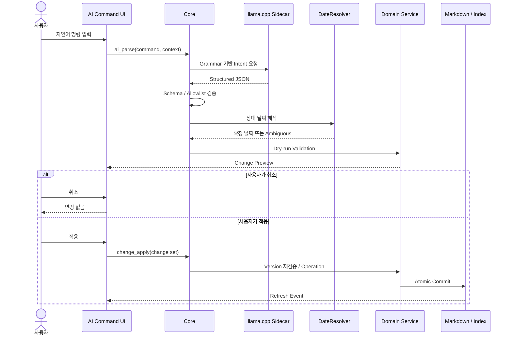
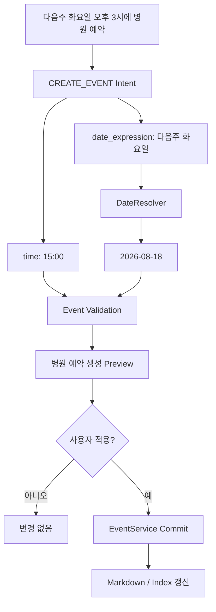
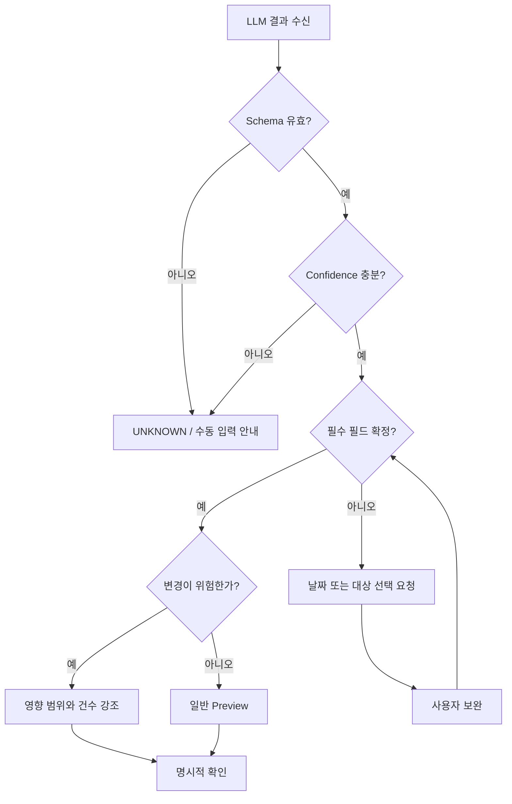
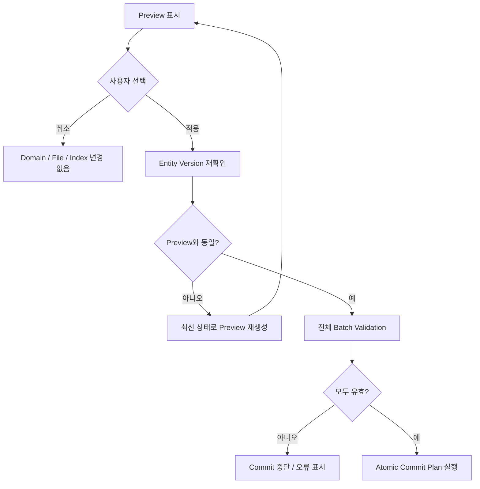

# AI Command Workflow

## 1. 기본 흐름

```text
자연어 입력
→ ai_parse(command, minimal context)
→ LLM sidecar 준비
→ JSON grammar 기반 Intent 생성
→ Schema/allowlist 검증
→ DateResolver가 상대 날짜 계산
→ Domain dry-run validation
→ Change Preview
→ 사용자 취소 또는 적용
→ change_apply(validated change set)
→ Domain operation
→ Markdown/Index commit
→ UI refresh
```

LLM 응답 자체는 실행 권한이 없다. `validated change set`에는 짧은 만료 시간과 hash를 두어 Preview 이후 원본이 바뀐 경우 다시 검증한다.



## 2. 예: Event 생성

사용자 입력:

```text
다음주 화요일 오후 3시에 병원 예약
```

LLM output:

```json
{
  "intent": "CREATE_EVENT",
  "arguments": {
    "title": "병원 예약",
    "date_expression": "다음주 화요일",
    "time": "15:00"
  }
}
```

Core 처리:

1. DateResolver가 기준일·Asia/Seoul을 사용해 날짜를 계산한다.
2. Event 필수 값과 시간 형식을 검증한다.
3. `2026-08-18 15:00 병원 예약 생성` Preview를 만든다.
4. 사용자가 적용하면 EventService가 파일과 index를 갱신한다.



## 3. 불완전하거나 위험한 명령

- 날짜가 모호하면 Preview 적용 버튼 대신 날짜 선택을 요구한다.
- UPDATE/DELETE 대상이 여러 개면 후보를 보여주고 사용자가 하나를 선택한다.
- confidence가 낮거나 schema가 틀리면 UNKNOWN으로 처리한다.
- LLM timeout/process 실패 시 수동 입력 화면으로 전환하며 다른 앱 기능은 유지한다.
- Delete와 여러 Entity 일괄 변경은 영향 범위와 변경 건수를 Preview에 명시한다.



## 4. 취소와 적용

- 취소: Domain, 파일, index 어느 것도 바꾸지 않는다.
- 적용: Preview 당시 entity version을 다시 확인한다.
- version 불일치: 새 상태로 Preview를 재생성한다.
- 일부만 성공하는 batch는 허용하지 않는다. 먼저 전체 validation 후 commit 계획을 만든다.


