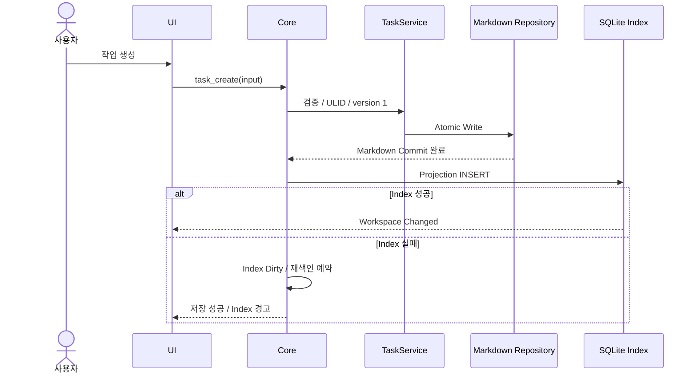
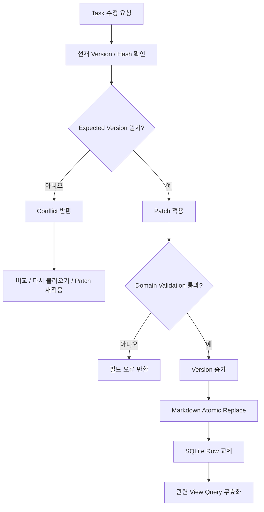
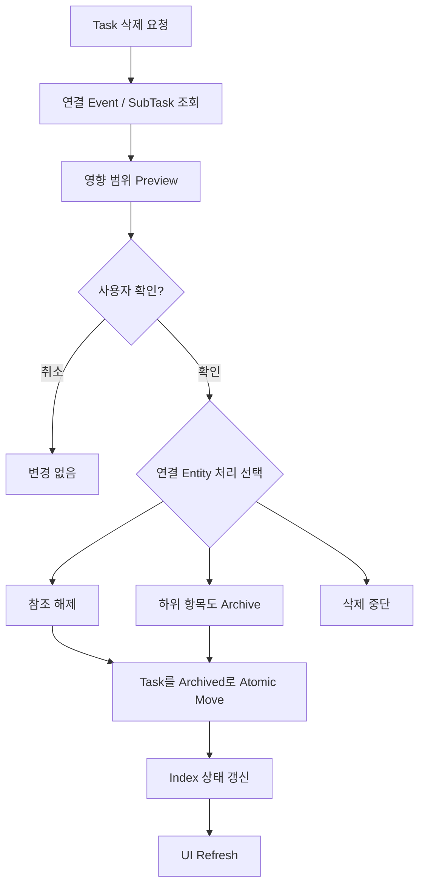
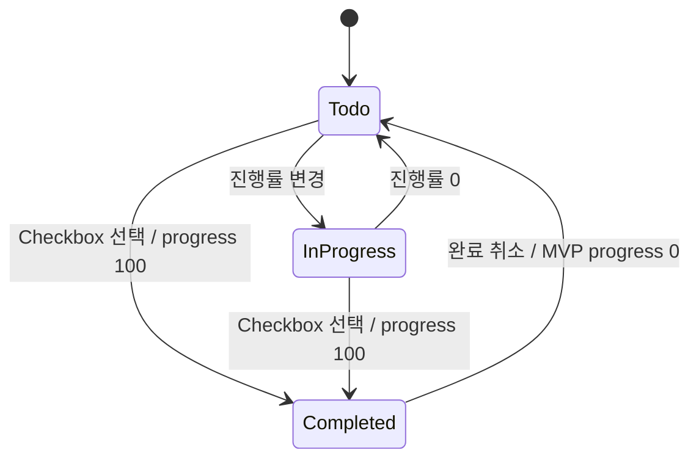
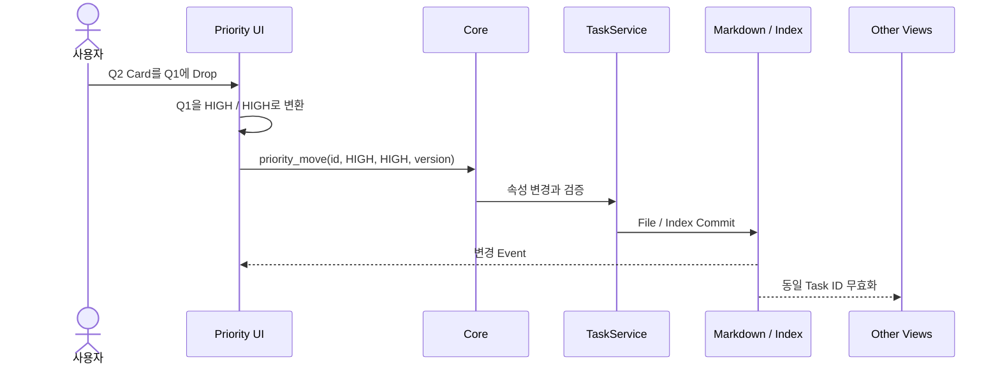
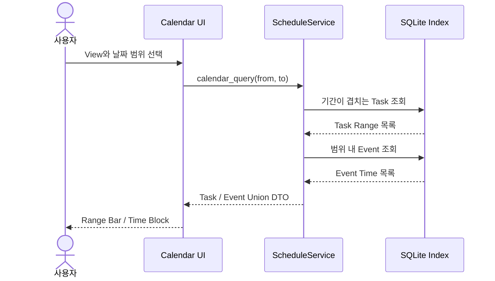
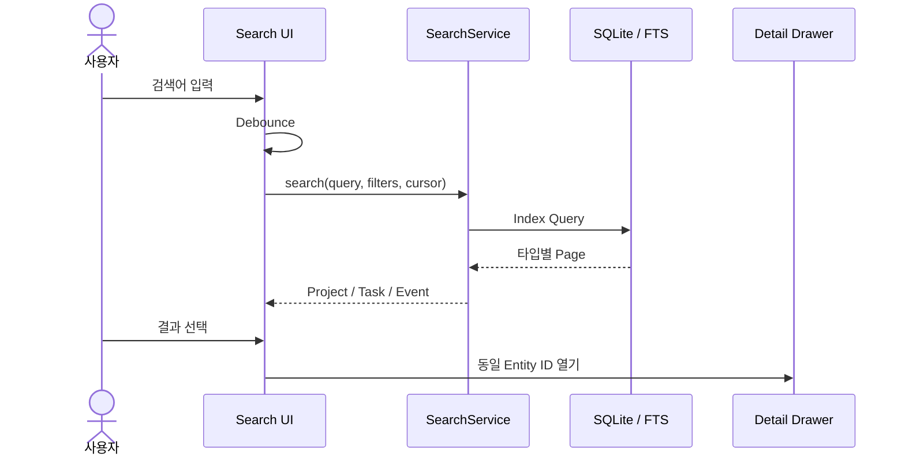

# Domain Operation Workflow

## 1. Task 생성

```text
UI Form
→ task_create(input)
→ TaskService validation
→ ULID/version=1 부여
→ Markdown serialize
→ temp write → fsync → atomic rename
→ tasks projection INSERT
→ workspace://changed
→ UI query refresh
```

File commit 후 SQLite가 실패하면 성공한 Markdown은 유지하고 `index_dirty` 상태와 재색인 job을 만든다.



## 2. Task 수정

```text
UI가 task id + expected version 전송
→ 현재 file hash/version 확인
→ 불일치하면 Conflict 반환
→ patch를 Domain에 적용하고 validation
→ version 증가
→ atomic replace
→ index row 교체
→ 관련 Home/Priority/Gantt/Calendar query 무효화
```

날짜 변경은 `start_date ≤ end_date`, parent 변경은 순환 계층 금지, progress 완료는 status 정책과 일치해야 한다.



## 3. Task 삭제

MVP 기본은 즉시 영구 삭제보다 Archive 이동이다.

```text
사용자 삭제 요청
→ 연결 Event/SubTask 영향 Preview
→ 사용자 확인
→ tasks/archived로 atomic move + archived status
→ active index에서 제외 또는 row 상태 갱신
→ UI refresh
```

영구 삭제는 Archive에서 별도 확인을 거치며 recovery 보관 정책을 적용한다. 연결 Event는 자동 삭제하지 않고 `related_task_id`를 해제하거나 사용자 선택을 받는다.



## 4. 완료 상태 변경

```text
Checkbox
→ task_complete(id, completed, expected_version)
→ status/progress 정책 적용
→ atomic file update
→ index update
→ Home metric과 모든 View refresh
```

완료 시 기존 progress를 복원할 필요가 있다면 `previous_progress`는 UI 임시 상태가 아니라 Domain 정책으로 결정한다. MVP는 완료=100, 완료 취소=0 또는 사용자가 지정한 값으로 명시한다.



## 5. Priority 이동

```text
Q2 Card drag
→ Q1 drop preview
→ priority_move(id, HIGH, HIGH, version)
→ TaskService update
→ file/index commit
→ 사분면과 Home 우선 확인 갱신
```

Drop 위치는 숫자 좌표가 아니라 importance/urgency enum으로 변환해 Core에 보낸다.



## 6. Calendar 조회

```text
Month/Week/Day + date range 선택
→ calendar_query(from, to)
→ tasks: start_date <= to AND end_date >= from
→ events: date BETWEEN from AND to
→ ScheduleService가 별도 DTO로 조합
→ Task range와 Event time block 렌더링
```

Task와 Event를 하나의 Entity로 합치지 않고 표시용 union DTO만 사용한다.



## 7. Gantt 조회와 변경

```text
Project/기간/Zoom 선택
→ gantt_query(project_id, from, to, zoom)
→ Project + 해당 기간 Task 계층 조회
→ expand 상태에 맞춰 row virtualization
→ bar와 today line 렌더링
```

향후 bar drag/resize는 먼저 날짜 변경 Preview를 만들고 `task_update`를 호출한다. Milestone과 dependency는 MVP 뒤에 추가한다.

```mermaid
flowchart LR
    A[Project / 기간 / Zoom 선택] --> B[Gantt Query]
    B --> C[Project와 Task 계층 조회]
    C --> D[Expand / Collapse 적용]
    D --> E[Visible Row 계산]
    E --> F[Row Virtualization]
    F --> G[Project / Task Bar 렌더링]
    G --> H[Today Line 표시]
    H -. 향후 .-> I[Bar Drag / Resize Preview]
    I --> J[Task Update]
```



## 8. 검색

```text
사용자 입력
→ 짧은 debounce
→ search(query, filters, cursor)
→ SQLite/FTS index 조회
→ Project/Task/Event 타입별 결과
→ 결과 선택 시 동일 Detail Drawer
```

파일 내용 전체를 매 검색마다 scan하지 않는다.


