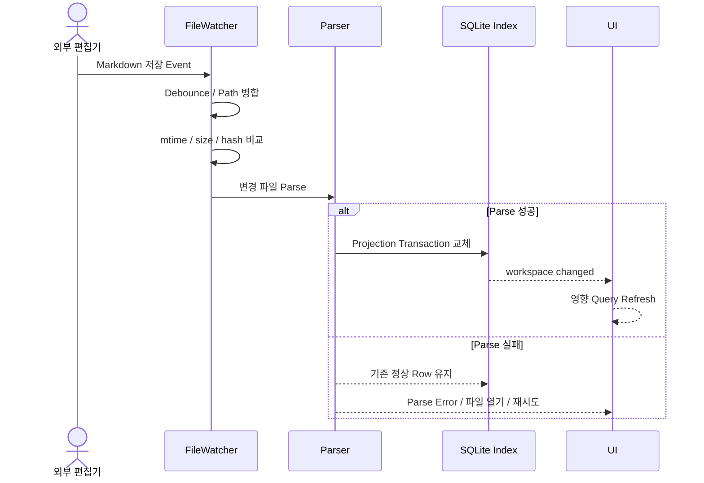
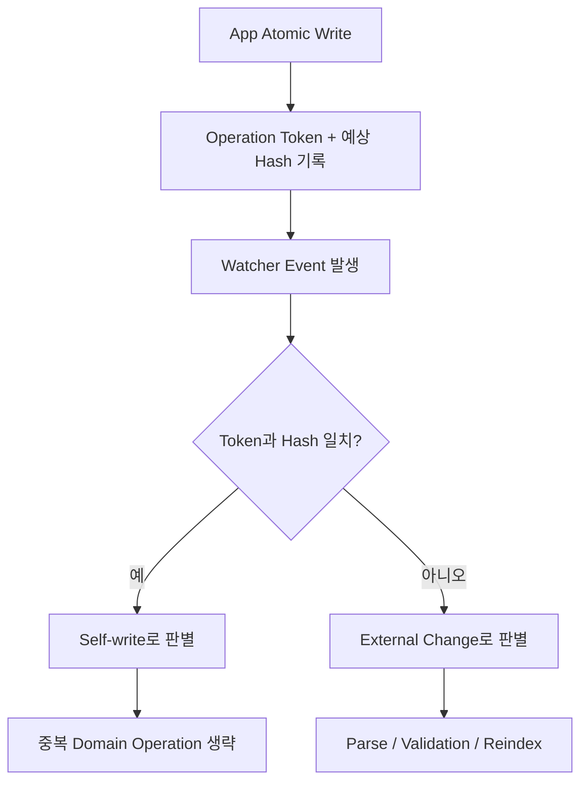
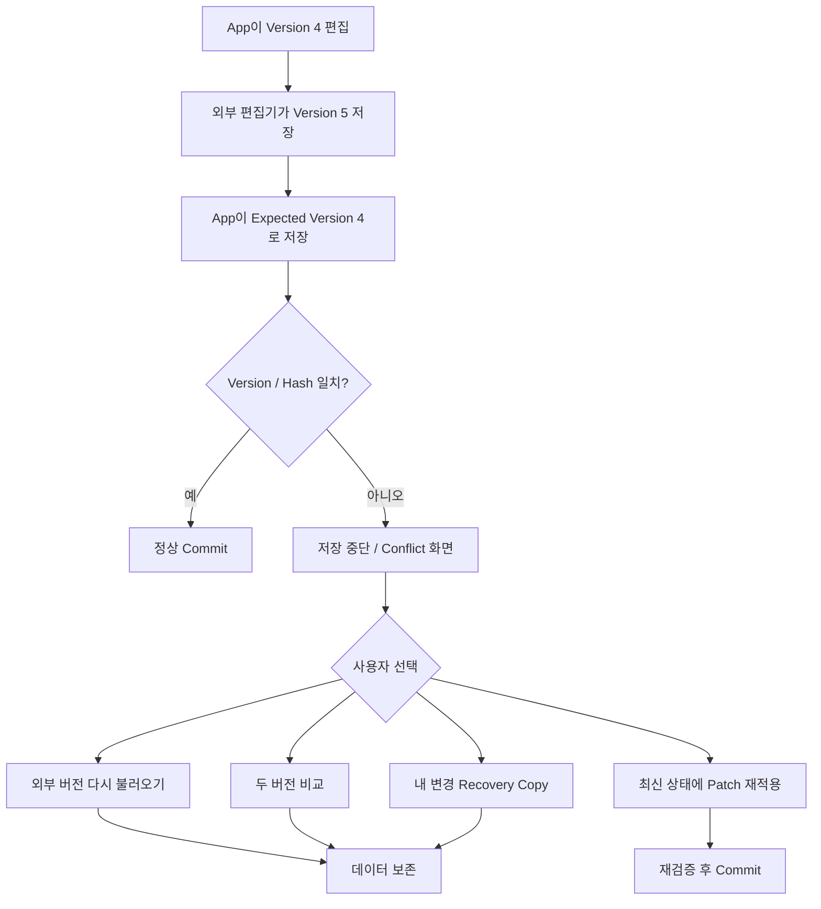
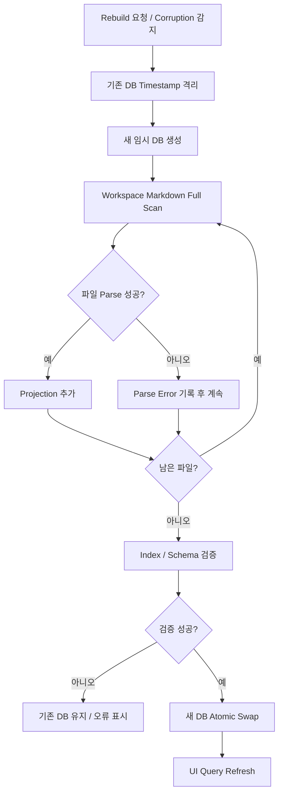
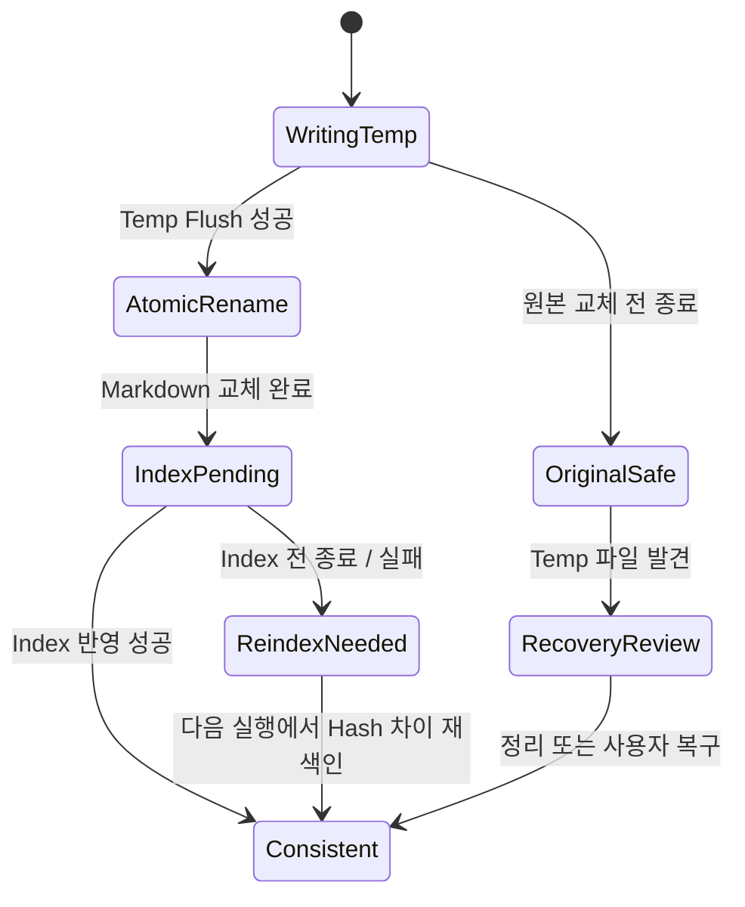
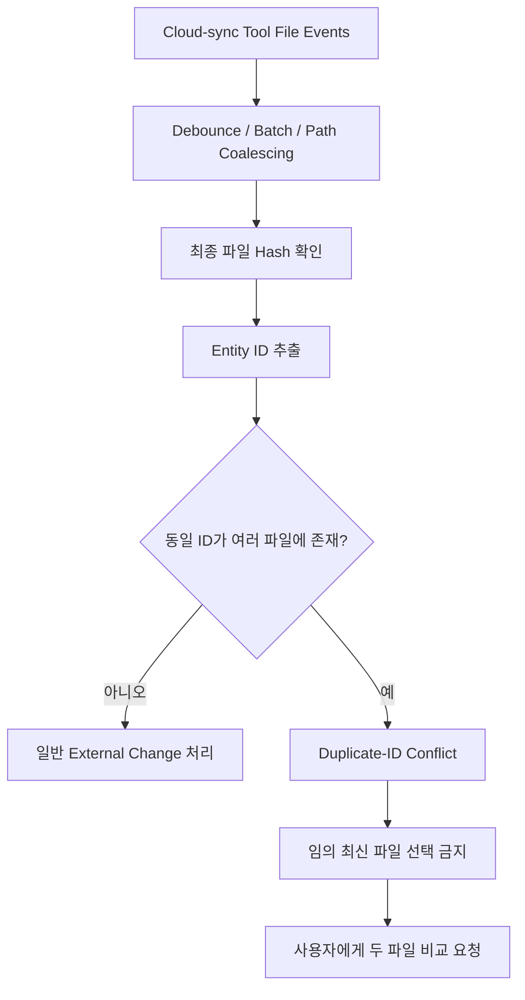

# 동기화와 복구 Workflow

## 1. 외부 파일 수정

```text
VS Code/Obsidian에서 Markdown 저장
→ FileWatcher event
→ 250~500ms debounce/path coalescing
→ mtime/size 확인
→ content hash 비교
→ Markdown parse/Domain validation
→ 해당 SQLite projection transaction 교체
→ workspace://changed
→ 영향받은 화면 query refresh
```

파싱 실패 시 마지막 정상 index를 지우지 않는다. 화면에는 해당 데이터가 외부 파일 오류 때문에 오래된 상태일 수 있음을 표시하고 파일 열기·재시도 동작을 제공한다.



## 2. App 자체 쓰기와 Watcher

1. FileRepository가 write operation token과 예상 hash를 기록한다.
2. Atomic rename으로 발생한 watcher event를 token/hash와 비교한다.
3. 동일한 self-write면 중복 Domain operation은 하지 않고 상태만 확인한다.
4. 예상 hash와 다르면 외부 변경으로 처리한다.



## 3. 동시 수정 충돌

```text
App이 version 4를 편집 중
→ 외부 편집기가 version 5/hash B 저장
→ App이 expected version 4로 저장 요청
→ Core가 불일치 검출
→ 저장 중단
→ Conflict 화면
```

사용자 선택:

- 외부 버전을 다시 불러오고 내 변경을 폼에 유지
- 두 버전 비교
- 내 변경을 별도 recovery copy로 저장
- 최신 상태에 내 field patch를 다시 적용

MVP는 자동 text merge보다 데이터 보존과 명시적 선택을 우선한다.



## 4. Index 재생성

```text
사용자 Rebuild 또는 corruption 감지
→ 기존 DB를 timestamp 이름으로 격리
→ 새 임시 DB 생성
→ Workspace Markdown full scan
→ 파일별 parse와 progress event
→ 오류 파일은 parse_errors에 기록하고 계속 진행
→ index/schema 검증
→ 새 DB atomic swap
→ UI query refresh
```

재생성 중에는 마지막 정상 index를 읽기 전용으로 쓸 수 있다. 새 index가 검증되기 전 기존 DB를 삭제하지 않는다.



## 5. 앱 강제 종료/쓰기 실패

- 원본 교체 전 종료: temp/recovery 파일만 남고 원본은 정상이다.
- rename 후 index 전 종료: 다음 실행 시 source hash 차이를 감지해 재색인한다.
- recovery temp 발견: 원본 hash와 비교해 안전하면 정리하고, 불명확하면 사용자에게 복구 후보를 보여준다.
- 디스크 공간 부족/권한 오류: 원본을 유지하고 저장하지 못한 변경을 메모리와 recovery 가능한 형식으로 제시한다.



## 6. Cloud-sync 폴더 사용

Dropbox·OneDrive·Syncthing 등이 rename과 임시 파일 이벤트를 연속 발생시킬 수 있으므로 event를 배치한다. 동일 ID가 다른 파일에 나타나면 최신 파일을 임의 선택하지 않고 duplicate-ID conflict로 표시한다. My Planner 자체는 MVP에서 별도 Cloud Sync를 제공하지 않는다.


