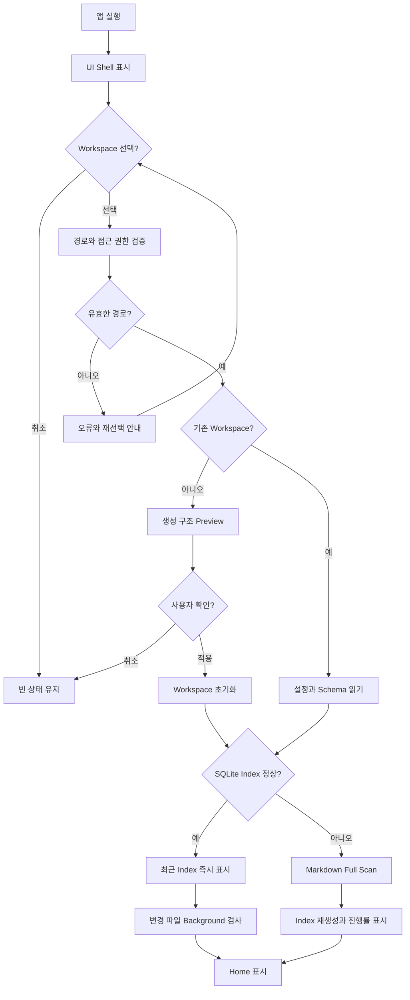
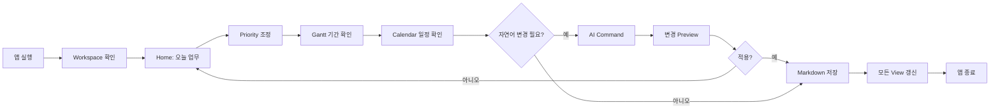
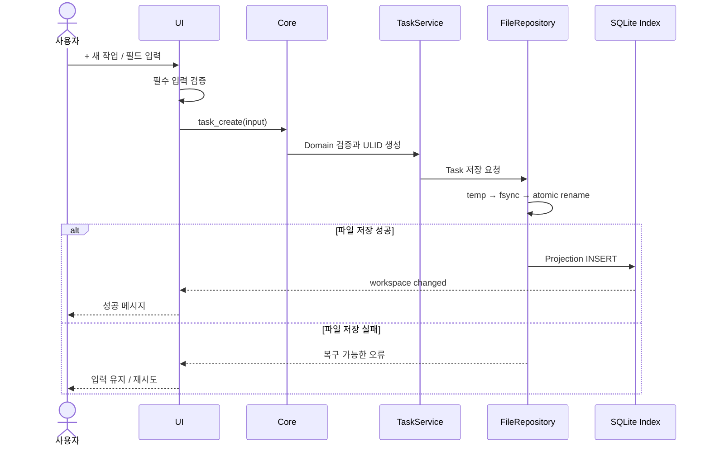
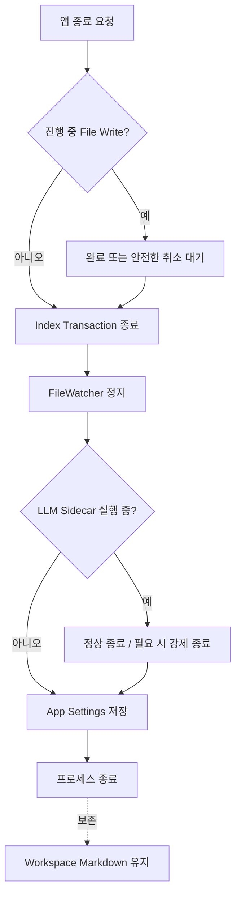

# 사용자 업무 프로세스

## 1. 최초 실행과 Workspace 선택

1. 사용자가 앱을 실행한다.
2. UI Shell이 먼저 열리고 `Workspace 선택`을 표시한다.
3. 사용자가 자신이 소유한 Local Folder를 선택한다.
4. Core가 canonical path와 접근 가능 여부를 검증한다.
5. 기존 `.planner/workspace.json`이 있으면 설정과 schema를 읽는다.
6. 새 폴더라면 생성될 구조와 파일을 Preview한 후 사용자 확인을 받는다.
7. SQLite가 정상이면 최근 index를 즉시 표시하고 background에서 변경 파일만 검사한다.
8. Index가 없거나 손상되었으면 Markdown을 scan하며 진행률을 표시한다.
9. 완료되면 Home의 오늘 업무가 나타난다.

Workspace 밖의 파일은 읽거나 쓰지 않는다. 선택 취소 시 앱은 빈 상태로 유지된다.



## 2. 일상적인 이용 과정

```text
앱 실행
→ 최근 Workspace 확인/선택
→ Home에서 오늘 Task와 Event 확인
→ Task 완료 또는 상세 열기
→ Priority에서 중요도·시급성 조정
→ Gantt에서 프로젝트 기간 확인/수정
→ Calendar에서 날짜·시간 일정 확인
→ 필요 시 AI Command로 변경안 생성
→ Preview 확인 후 적용
→ Markdown 자동 저장
→ 앱 종료
```



Priority, Gantt, Calendar는 다른 데이터 저장소가 아니다. 예를 들어 `보고서 작성` Task를 Priority에서 옮기면 Gantt와 Calendar가 같은 ID의 변경을 즉시 반영한다.

## 3. 수동 새 작업 생성

1. 사용자가 `+ 새 작업`을 누른다.
2. 제목, 기간/마감, Project, 중요도, 시급성을 입력한다.
3. UI는 필수 입력 누락만 빠르게 확인한다.
4. 저장 요청 후 Core가 날짜 범위, 계층 순환, Project 존재 여부를 검증한다.
5. 확정 데이터와 새 ULID를 가진 Task 파일을 atomic write한다.
6. Index와 UI가 갱신되고 성공 메시지가 나타난다.
7. 쓰기 실패 시 입력 값은 Modal에 유지되어 재시도할 수 있다.



## 4. 앱 종료

1. 진행 중 file write가 있으면 완료 또는 안전한 취소를 기다린다.
2. Index transaction을 마무리하고 watcher를 정지한다.
3. LLM sidecar가 실행 중이면 정상 종료 후 필요 시 강제 종료한다.
4. 창 상태와 최근 Workspace는 App Settings에 저장한다.
5. Markdown은 앱 설치 경로와 무관하게 Workspace에 남는다.


